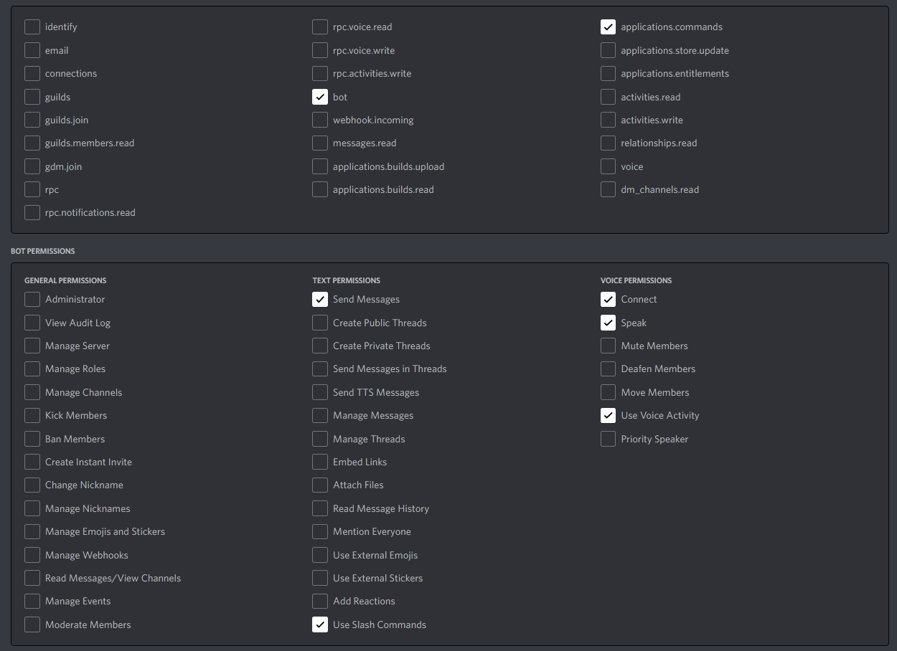

# 準備
以下、Windowsを想定しておきます。

## coeiroinkのダウンロード

[COEIROINK-DOWNLOAD](https://coeiroink.com/download)からダウンロードします。ページに記載されているように、GPU版の場合はcudaのインストールも必要です。  
ダウンロードが終わったら解凍しておきます。

## voicevox のダウンロード

https://voicevox.hiroshiba.jp/ からダウンロードします。

## テストする用のdiscordサーバーを建てる

discordの画面左の+ボタンからできます。

## discord botのセットアップ

[Discord Developer Portal](https://discord.com/developers/applications)からセットアップします。

1. New Applicationをクリックして、アプリの名前を入力、CREATEを押します。(ボットの名前ではないので適当でいいです。)
2. 左のメニューからBotを選択、Add Botを押します。
3. Botを作ると、Privileged Gateway Intentsという項目があります。このチェックを全部入れてください。最後にSave Changesをクリックして保存します。

4. Botのアイコンの横にある、Reset TokenをクリックしてTokenを生成します。コピーしてどこかにメモしておいてください。流出するとボットを制御されてしまうので注意。
5. 左のメニューからOAuth2のURL Generatorを選択し、Botに与える権限を選びます。
    - SCOPESのbot,applications.commands
    - TEXT PERMISSIONSのSend Messages,Use Slash Commands
    - VOICE PERMISSIONSのConnect, Speak, Use Voice Activity

6. 下のGENERATED URLをコピーして、ブラウザの別タブで開きます。追加するサーバーを選択して認証をします。
7. 選択したサーバーにBotが参加したらセットアップ完了です。

## ffmpegのダウンロード

音声を再生するためにffmpegが必要です。

1. から、最新バージョンのessentials_buildをダウンロードして解凍してください。
2. binフォルダにffmpeg.exeが入っています。このフォルダにPATHを通してください。

## 実行方法

1. .env.sample と同じディレクトリに .env というファイルを作成します。
2. .env.sample に従って .env の `DATABASE_URL` にデータベースを置くパスを sqlite:(PATH) の形式で入力します。
3. .env.sample に従って .env に bot の token,application id を入力します。
4. .env.sample に従って COEIROINK が動いているアドレス(デフォルトはおそらく http://127.0.0.1:50031 ) を入力します。 (optional)
5. .env.sample に従って VOICEVOX が動いているアドレス(デフォルトはおそらく http://127.0.0.1:50021 ) を入力します。 (optional)
6. .env.sample に従って wolfram alpha API の id を入力します。 (optional)
7. cargo install sqlx-cli を実行します。
8. cargo sqlx database create を実行します。(1.の場所に生成されます)
9. cargo sqlx migrate run を実行します。
10. cargo build --release を実行します。
11. target/release/nap-chan.exe を実行します。
